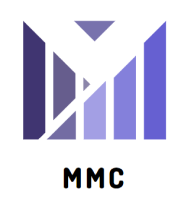
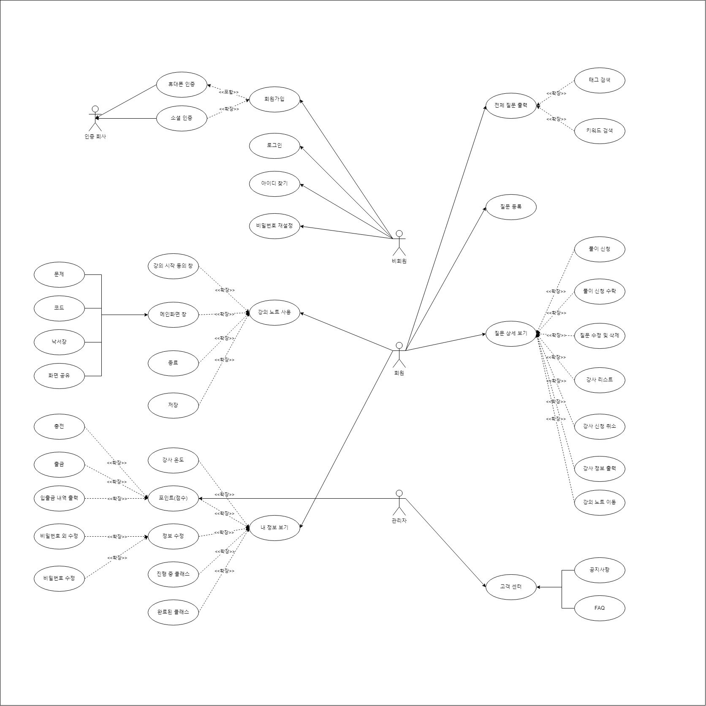

# MMC(Many Make Code)

- 서비스 내용 : 온라인 코딩 강의

- 서비스 주요 기능 :
    - WebRTC를 통한 화면 공유
    - WebSocket과 Redis를 이용한 실시간 드로잉 툴
- 개발기간 : 2022.01.02~2022.02.17 (7주)
- 플래폼 : Web
- 담당 역할 : 5명
    - 기성도 : Front-end (UI/UX , UCC)
    - 김원혁 : Front-end (WebRTC)
    - 김정민 : Back-end (WebSocket, Redis)
    - 김형균 : Back-end (배포, JWT)
    - 양현용 : Back-end (연동 및 외부Api, Mysql)
- 개발 환경
    - 언어 : Java11, HTML/CSS, JavaScript
    - 프레임워크 : Spring, React
    - DB : Mysql, Redis
    - IDE : IntelliJ, Vscode
    - API, 라이브러리 : Grabzit, Ideone, Solved.ac

-배포 환경
    - 서버 : AWS EC2, ubuntu 22.04.1 LTS
    - docker : 23.0.1
    - docker-compose : 2.5.0
    - mysql : 8.0.32
    - redis : 5.0.7 

- Server Port
    - web server(nginx) : 80port
    - proxy server(https) : 443port
    - react(nginx) : 3000port
    - springboot(tomcat) : 8083port
    - Nodejs(web-socket) : 8000port
    - Nodejs(webRTC) : 8001port
    - mysql : 3306port
    - redis : 6379port

- Docker 사용 서버
    - react(nginx) , spring , nodejs(web-socket) , nodejs(webRTC) 

- SSL
    - 하나의 사이트에서 http와 https가 mix 되면 안되기 때문에 모든 요청을 아래와 같이 80port 로 받은 후 proxy server인 443port로 보내주어 redirect 시켜준다.

- SSL nginx 설정 파일
```
server {
        listen 80 default_server;
        listen [::]:80 default_server;

        server_name _;
        return 301 https:$host$request_uri;

}


server{

        listen 443 ssl;
        server_name i8a508.p.ssafy.io; # 도메인으로 변경

        ssl_certificate /etc/letsencrypt/live/i8a508.p.ssafy.io/fullchain.pem;
        ssl_certificate_key /etc/letsencrypt/live/i8a508.p.ssafy.io/privkey.pem;
        include /etc/letsencrypt/options-ssl-nginx.conf;
        location / {

                proxy_pass http://i8a508.p.ssafy.io:3000;
        }

        location /api {
                proxy_pass http://i8a508.p.ssafy.io:8083;
        }

        location ^~ /websocket {
                proxy_pass http://i8a508.p.ssafy.io:8000;


                proxy_http_version      1.1;
                proxy_set_header        Upgrade $http_upgrade;
                proxy_set_header        Connection "upgrade";
                proxy_set_header        Host $host;
        }

        location ^~ /socket.io {

                proxy_set_header X-Real-IP $remote_addr;
                proxy_set_header X-Forwarded-For $remote_addr;
                proxy_set_header X-Client-Verify SUCCESS;
                proxy_set_header Host $http_host;
                proxy_set_header X-NginX-Proxy true;
                proxy_http_version 1.1;
                proxy_set_header Upgrade $http_upgrade;
                proxy_set_header Connection "upgrade";
                proxy_pass http://i8a508.p.ssafy.io:8001;
                proxy_redirect off;
                proxy_buffering off;


        }

}
```

- 시연 영상 : [https://youtu.be/CXmn76vtSew](https://youtu.be/CXmn76vtSew)
- UCC : [https://youtu.be/yobItHNKP1M](https://youtu.be/yobItHNKP1M)


## 서비스 소개

❓코딩하다가 모르면 어디다 물어보시나요?

❓말로 설명하고 듣기에는 답답하신가요?

❓단순한 문제 풀이가 아닌 내 코드에 맞는 설명을 듣고 싶으신가요?



MMC는 화면을 공유하고 문제, 나의 코드, 드로잉, 채팅 등을 실시간으로 공유할 수 있는 서비스 입니다.

문제와 나의 코드를 적고 내가 궁금한 점을 적어서 나에게 딱 맞는 설명을 들어보세요!

## 기술스택


## 서비스 특장점

- 실시간 기능
    - 궁그

## 유스케이스



## DB&API 설계서

### Rest API


### ERD


## 페이지 기획서

### 페이지 목업 설계

[https://www.figma.com/embed?embed_host=notion&url=https%3A%2F%2Fwww.figma.com%2Ffile%2FUVvPQKBafi9Za3096C5xll%2FMMT%3Fnode-id%3D964%3A31%26t%3DBy3n8geX0EKkakOa-0](https://www.figma.com/embed?embed_host=notion&url=https%3A%2F%2Fwww.figma.com%2Ffile%2FUVvPQKBafi9Za3096C5xll%2FMMT%3Fnode-id%3D964%3A31%26t%3DBy3n8geX0EKkakOa-0)

### 페이지 상세설정


## 페이지 나열

- 메인 페이지
    - 전체 회원, 진행중 질문, 완료된 질문 DB 정보 출력


- 로그인 페이지
    - 코딩 하러가기 클릭시 아이디 패스워드를 backend로 전송, DB 통신 후 정보 일치하면 BE에서 DB와 FE로 accessToken, refreshToken 전송 , 로그인 상태 update


- 회원가입 페이지
    - react-images-upload 라이브러리로 이미지 업로드 기능 구현
    - mui- TextField 사용하여 정보 BE 로 전달


- 전체 질문 리스트
    - FE에서 필터링 (최근 등록순, 키워드 제목, 카테고리, 문제유형 includes 검색)
    - useEffect 연동으로 실시간 필터링
    - 채택 전, 진행 중 질문만 출력, 완료된 질문은 제외


- 전체 질문 리스트 (C++, 알고리즘 선택)


- 전체 질문 리스트 ( java 선택)


- 전체 질문 리스트 (키워드 : 트리 검색)


- 질문 등록하기
    - form 태그로 input, 날짜 데이터 react-datepicker ,question table에 저장
    - 궁금한 내용, 질문한 코드 row값 4로 설정


- 질문 등록 완료
    - 질문 등록 후 자동으로 전체질문 페이지로 navigate


- 질문 상세 페이지 ( 메인) - 질문자 입장
    - react 컴포넌트로 메인, 문제, 코드 생성 후 클릭 시마다 re-rendering


- 질문 상세 페이지 - 답변자 입장


- 질문 상세 페이지 ( 문제)
    - src 정보에 s3 url 경로 설정해주고 return 값으로 문제 출력


- 질문 상세 페이지(코드 )


- 강사 리스트 내 강사 프로필 확인
    - 강사 프로필 누르면 백준 티어 및 정보 가져오기
    - 백준 티어 : [solved.ac](http://solved.ac) api를 사용하여 아이디 정보를 넘겨주고 tier 를 받아와 계산 후 출력


- 강사 채택 완료시 채택 완료 후 강의실 입장 버튼 생성
    - 채택하기 클릭하면  progress column에 강사 id로 업데이트 함, progress 저장된 상탯값과 사용자의 id 값을 비교하여 답변을 신청한 사람인지를 판단, 질문 상세 정보에 포함된 질문자 id 와 사용자 id 값을 비교하여 질문을 등록한 사람인지 판단하여 두 사용자에게만 강의실 입장 버튼이 보이도록 함


- 마이페이지에서 나의 질문 , 나의 강의 이동 가능
    - menuItem mui 사용


- 질문자의 경우 나의 질문 페이지에서 갈색으로 확인 가능


- 답변자의 경우 나의 강의 페이지에서 갈색으로 확인 가


- 강의 대기
    - lecturenoteid 에 해당하는 socket[lecturenoteid]의 인원 수를 불러와 클릭하여 대기 중인 인원을 판별한다. 2명이 모두 대기완료 전까지는 대기 중 화면을 띄우고 둘 다 완료한 경우 강의 페이지로 접속
    - [socket.io](http://socket.io) 로 webRTC 및 websocket 통신에 필요한 정보 교환


 

- 강의 노트 - 문제
    - websocket 통신 이용한 실시간 그림판 기능
    - 강의 시작과 함께 서버에 저장된 시간을 기준으로 timer 설정
    - 문제, 코드, 그림, 화면 컴포넌트 각각 생성하여 화면 이동
    - 마이크 버튼으로 본인의 마이크 mute 설정
    - websocket 통신으로 채팅 기능 구현


- 강의 노트 - 코드
    - ideone API를 이용하여 웹에서 코드 동작 기능 구현


- 강의 노트 - 그림
    - websocket 통신 이용한 실시간 그림판 기능


- 강의 노트 - 화면
    - webRTC로 받아온 상대방 videoTrack 화면에 띄우기,
    - 화면 공유 기능 추가


- 강의 종료 1분 전 알림
    - 1초마다 시간 정보를 interval로 가져와서 지정된 종료 시간 1분 전에 종료 전 알림


- 강의 종료 후 pdf 다운 선택
    - 학생의 경우 PDF 다운 jspdf 라이브러리 이용하여 그림판  및 문제에 적용된 그림 다운


- PDF 다운로드
    
    pdf 다운이 아래 사진과 같이 완료되는 것을 확인할 수 있음
    


- 강의자 온도 주기
    - 질문자가 온도 주는 것을 마지막으로 평가를 완료한 경우 BE에 질문 table의 progress 상태값을 완료로 변경하고 답변자의 온도 상태값을 평가값에 따라 update


- 수업 종료


- 강의 완료되면 내 강의 페이지에 완료로 적용
    - progress 상태값을 기준으로 채택 전, 진행 중, 종료된 강의로 텍스트 및 색을 활용하여 분리


